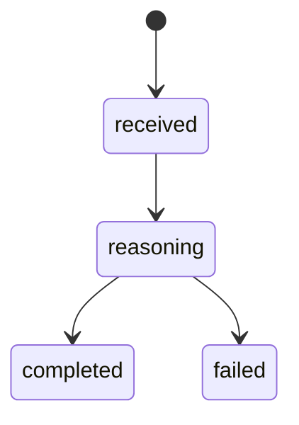
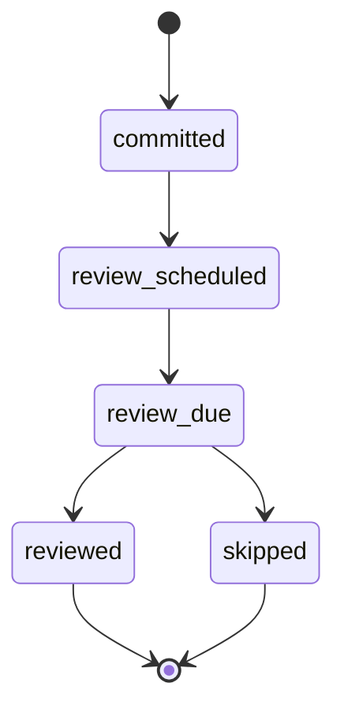
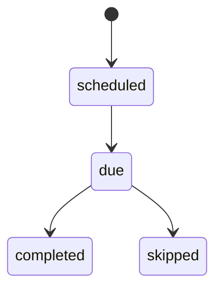

# Founder Decision Partner V1 Technical Spec

## Purpose

This document defines the minimum technical architecture for V1.

The goal is not to build a generic agent platform.

The goal is to build one production path:

> Telegram request -> decision reasoning -> recommendation -> memory commit -> scheduled review

## Architecture Overview

### Logical Components

1. `Telegram Gateway`
   Receives user messages and delivers responses.

2. `Decision Service`
   Owns the V1 decision workflow.

3. `Memory Adapter`
   Reads and writes vault-backed context plus structured operational records.

4. `Reasoning Pipeline`
   Runs the fixed decision protocol.

5. `Review Worker`
   Finds due reviews and sends follow-up prompts.

6. `Trace Store`
   Persists runs, evidence, decisions, and outcomes for evaluation.

## Recommended Runtime Split

### Keep

- aiogram for Telegram transport
- vault as rich long-term context

### Add

- FastAPI service for decision orchestration
- Postgres for structured operational state
- Redis for bot/session state if FSM remains in production flows

Rationale:

- Context7 confirms `MemoryStorage` is not suitable for production because state is lost on restart.
- Context7 confirms FastAPI dependency injection is suitable for a service layer, while delayed review jobs should live in a scheduler/worker rather than only in request-scoped background tasks.

## System Boundaries

### Telegram Gateway

Responsibilities:

- normalize incoming message into a `decision_request`
- call `Decision Service`
- return formatted answer
- handle `/decide`, `/review`, `/status` later

Does not own:

- business logic
- memory writes other than raw message capture
- scheduling

### Decision Service

Responsibilities:

- request classification
- context retrieval
- pattern detection
- recommendation generation
- counter-argument generation
- persistence of run outputs

### Memory Adapter

Responsibilities:

- read relevant vault notes and dialogue history
- write decision summaries back into vault if needed
- maintain structured records in operational storage

### Review Worker

Responsibilities:

- find due reviews
- send review prompts
- capture review outcomes
- update pattern memory based on outcome

## Core Entities

### `workspace`

Represents one user's thinking environment.

Fields:

- `id`
- `name`
- `timezone`
- `vault_path`
- `created_at`
- `updated_at`

### `decision_run`

One execution of the decision engine.

Fields:

- `id`
- `workspace_id`
- `source_message_id`
- `request_text`
- `decision_type`
- `time_horizon_days`
- `status`
- `final_verdict`
- `created_at`
- `completed_at`

Status values:

- `received`
- `reasoning`
- `completed`
- `failed`

### `decision_record`

Canonical record of the recommendation committed to memory.

Fields:

- `id`
- `workspace_id`
- `decision_run_id`
- `title`
- `decision_type`
- `decision_summary`
- `chosen_option`
- `rejected_options`
- `why`
- `risks`
- `expected_signals`
- `time_horizon_days`
- `review_date`
- `confidence`
- `created_at`
- `updated_at`

### `pattern_record`

Structured behavioral or reasoning pattern.

Fields:

- `id`
- `workspace_id`
- `name`
- `category`
- `description`
- `evidence`
- `confidence`
- `status`
- `last_seen_at`
- `created_at`
- `updated_at`

Category values:

- `decision_pattern`
- `failure_loop`
- `bias`
- `thinking_style`

Status values:

- `active`
- `watch`
- `archived`

### `review_record`

Follow-up checkpoint for a prior decision.

Fields:

- `id`
- `workspace_id`
- `decision_record_id`
- `due_at`
- `status`
- `expected_outcome`
- `actual_outcome`
- `user_response`
- `agent_assessment`
- `created_at`
- `completed_at`

Status values:

- `scheduled`
- `due`
- `completed`
- `skipped`

### `reasoning_trace`

Internal trace for evaluation and debugging.

Fields:

- `id`
- `decision_run_id`
- `context_snapshot`
- `retrieved_items`
- `tension_map`
- `detected_patterns`
- `counter_argument`
- `model_name`
- `latency_ms`
- `token_usage`
- `created_at`

## Memory Layers

### 1. Narrative Memory

Source:

- vault notes
- daily logs
- conversation summaries

Purpose:

- rich, human-readable context

### 2. Decision Memory

Source:

- `decision_record`
- `review_record`

Purpose:

- track decisions, rationale, and outcomes

### 3. Pattern Memory

Source:

- `pattern_record`

Purpose:

- maintain a durable model of behavior and thinking style

## Decision Request Contract

Input:

- raw user message
- workspace id
- recent dialogue history
- current active decisions

Output:

- verdict
- rationale
- rejected directions
- risks
- 7-14 day check criteria
- created `decision_record`
- created `review_record`

## Reasoning Pipeline

Stages:

1. `classify_request`
2. `retrieve_context`
3. `build_tension_map`
4. `detect_bias_and_patterns`
5. `generate_recommendation`
6. `generate_counter_argument`
7. `compose_response`
8. `commit_decision_and_schedule_review`

Each stage should produce structured output for traceability.

## State Machine

### Decision Run

### Decision Lifecycle

### Review Lifecycle

## Review Loop Rules

When a decision is committed:

- assign default `time_horizon_days = 14`
- create `review_record`
- store expected signals

When the review becomes due:

- send a check-in prompt
- capture the user's outcome
- compare expected vs actual
- update or create `pattern_record`

## Telegram Commands For V1

### `/decide`

Main entry point for decision support.

### `/review`

Shows due or recent reviews.

### `/decisions`

Shows recent decisions and their status.

### `/patterns`

Optional later command for surfacing repeated behavioral loops.

## Response Format Contract

Telegram response should always contain:

1. `Verdict`
2. `Why`
3. `Do Not Do`
4. `Risks`
5. `What To Check In 14 Days`

This should remain stable even as prompting evolves.

## Safety And Reliability Rules

1. Recommendation must be explicit.
2. Counter-argument must be generated before final response.
3. No freeform write access from raw user content to operational records.
4. Memory updates should happen through explicit commit steps.
5. Review loop must survive process restarts.

## V1 Implementation Note

The current repository should evolve toward:

- `bot/` for Telegram transport
- `services/decision_service.py` for orchestration
- `services/memory_adapter.py` for context access
- `services/review_service.py` for follow-up logic

The current shell-driven orchestration should not remain the long-term decision runtime.
